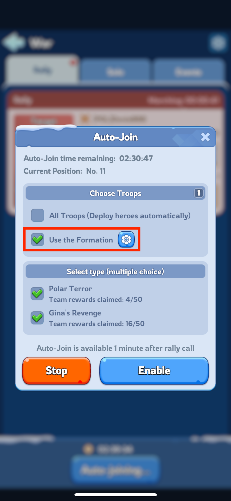
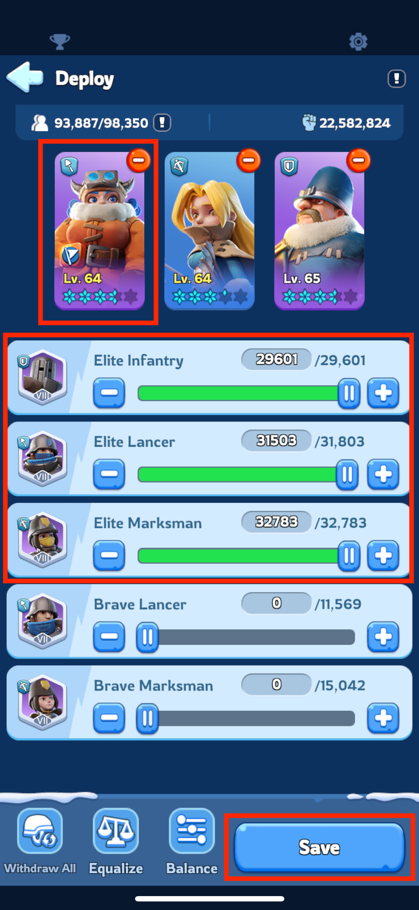
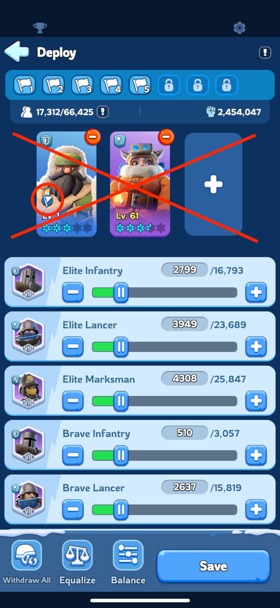

# Auto-join formation for monster hunting
When you enable Auto-Join, your squad will automatically join the rally created by your alliance members,
that match the types you've selected. 

It will trigger for Polar terror rally or Gina's revenge rally, 
it will not trigger for rallies towards other players or bear hunting rallies.

Once enabled, Auto-Join remains active for 8 hours, this time can be increased by reactivating Auto-Join.

**We highly recommend** everyone who uses this functionality to **set it up with designated Formation**.

## Setup

To enable automatic joining for monster hunting rallies, you need to click

`Alliance -> War -> Auto-join`.

Once there, check `Use the Formation` and click the `cog icon` to set up your squad for monster hunting.

Keep in mind that Auto-Join triggers for all levels of selected types of rallies, also Polar Terror lvl 4 or 5.
When we fight these stronger monsters, it is important to select the right heroes and troops for the job.

When creating your formation there, pick Jessie/Jasser or seo-yoon as the leading hero, because their skills provide very useful bonuses 
(check hero view -> skills tab -> upper-right skill).

This is crucial as selected rally captain can impact the whole rally and either give additional bonus, or destroy the bonus lineup for others.

### Example setup:

#### Correct:
This is an example of a setup for monster hunting, where we have selected Jessie as the rally captain. 
Jessie has first expedition skill which guarantees damage dealt bonus.

#### Incorrect:
Next example shows incorrect set up of heroes for joining rallies. Although Jessie is selected, she is not set as a rally captain, and her first expedition skill will not be used in rally.
instead, the first expedition skill of Eugene will be used, which is useless in a rally.

