# Bear Hunting Guide

The hunting event is activated by R4/R5 every two days at 18:00 UTC. Once the event starts, all members have only 30 minutes to defeat the raging bear. 
The rewards improve with the amount of damage your troops can inflict on the bear. Since the bear has a lot of health, a good strategy is crucial to maximize your damage output.

## Starting a Rally

Since rewards are based on the damage done to the bear, selecting the best heroes and troops is important. The stats and skills of all three heroes used by the rally captain are taken into account. 
Some heroes have expedition skills better suited for rallies. 

Consider using the following heroes when starting a rally as **free2play** player:

* **Molly** - skill #1 gives a chance to stun the target for 1 round, skill #2 gives 50% chance of additional damage, #3 guarantees damage dealt for all troops
* **Bahiti** - skill #2 gives 50% chance of increasing damage dealt by all troops
* **Sergey**

If you are **pay2win** player, you can also consider using:
* **Natalia** - increases all troops attack with activated Ursus Strength, #1 skills increases chance of stunning enemy for 1 round, #2 increases all troops attack, #3 increases damage dealt
* **Zinman** - skill #3 increases all troops damage
* **Jeronimo** - skill #1 increases damage dealt, #2 increases all troops attack, #3 gives chance of stunning a target for one round

In addition to expedition skills, your overall stats, including chief gear, charms, hero gear, and alliance attack % facilities, contribute to your damage. For maximum lethality, activate a war buff. 
Ensure your best gear, especially in the goggles and boots slots, is equipped on your top three attack heroes. 
For example, Natalia is an Infantry hero, so her gear should enhance Infantry lethality.

## Joining a Rally

There are special rules that apply when joining a rally created by another player. The first hero you add to the rally is crucial, especially this heroes first expedition skill (upper-right skill) 
which will/may be added to the bonus lineup for the whole rally.

Place one of these heroes in the first slot for maximum effectiveness:

* **Jessie**: Increases damage dealt by all troops
* **Jasser**: Increases damage dealt by all troops
* **Seo-yoon**: Increases all troops' attack

Prioritize skills that increase damage dealt, followed by those that increase troops' attack.

You can inspect the rally setup by clicking on a rally to expand participants, and then clicking a yellow flag icon. 
After scrolling all the way down you will see skills used from rally leading heroes, and the lineup of skills taken from rally participants. 
The goal here is that we accumulate only the right skills in this lineup, to get maximum damage dealt bonus.

### Examples 

#### Molly as Rally Captain
On screenshot below all participants put Molly as Rally Capitan, which resulted in rally members skill being 4 times Mollies first expedition skill - Calling of the snow, which stacked up together.
This expedition skill gives a chance of stunning the target for 1 round. So this is not a guaranteed bonus we get there, but a chance of getting a bonus.

|                        |
|:-----------------------------------------------------:| 
| *All rally joiners used Molly as their rally captain* |

|                                        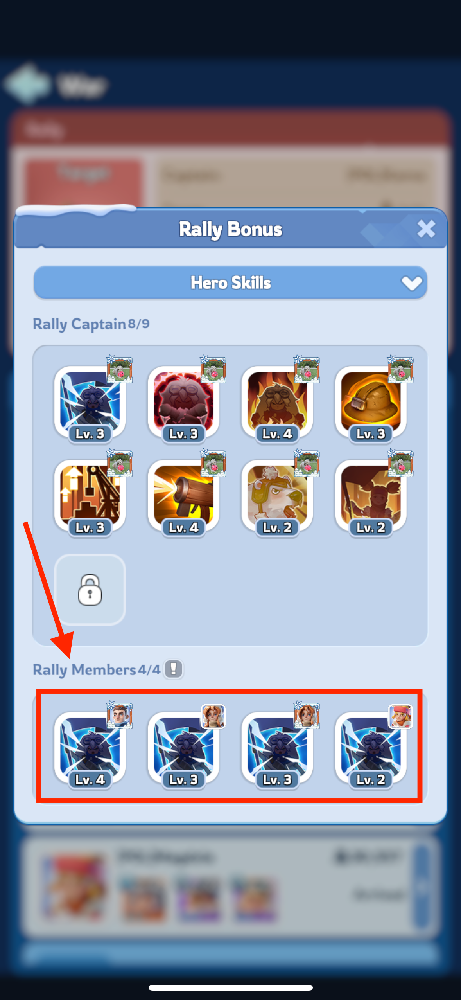                                         |
|:----------------------------------------------------------------------------------------------------------------------:|
| *Choosing Molly by all joiners resulted in first expedition skill of Molly being used in Rally Members lineup section* |

#### Jessie as Rally Captain

Following section illustrate the situation when rally joiners selected Jessie as their rally captain. 
In consequence the first expedition skill of Jessie is added to the skill lineup, and gives guaranteed damage dealt bonus.

|           |
|:------------------------------------------------------:|
| *All rally joiners used Jessie as their rally captain* |

|                                                                                    |
|:------------------------------------------------------------------------------------------------------------------------:| 
| *Choosing Jessie by all joiners resulted in first expedition skill of Jessie being used in Rally Members lineup section* |

#### Mix of different heroes as rally captains
Following section illustrate the situation when rally joiners selected different heroes as their rally captain.
In consequence the first expedition skill of each of them is considered a candidate to the skill lineup, and the 4 skills with the highest level will be selected.
|           |
|:------------------------------------------------------:|
| *All rally joiners but one used Jessie as their rally captain* |

In consequence of the above setup, Jessie skill was included in the lineup 3 times and one Molly skill. Even though 4 players joined with Jessie and just one with Molly, it happened that Molly' skill was on a higher level than one of Jessie' skill. 
**This means the rally setup lost one of guaranteed damage boosts, it could have had if Molly wasn't added to the rally.**

|                                                                                                      |
|:-----------------------------------------------------------------------------------------------------------------------------------------------:|
|                       *Despite 4 players joined with Jessie, Molly skill was added to the lineup, as it had higher level*                       |

To fix this issue a player with Molly as a rally captain could be removed from rally by the rally leader, then Jessie skill would be added 4 times.
To avoid this situation, it is better to join a rally with no heroes at all, as this will not impact the skill lineup.
In case of Molly, its skill does not guarantee a bonus, but gives a chance of getting it, so you may consider keeping it in the skill lineup. 
But when you see a blue or gathering hero is added to the rally as a captain, dont hesitate to remove it, because it negatively impacts the score for each rally participant.

|                                                                                                                 |
|:------------------------------------------------------------------------------------------------------------------------------------------------------:|
| *It is absolutely fine to join a rally without any hero. This will only impact your squad capacity, as you may be able to send less troops into rally* |

## Save Your Formations
Go to avatar -> Troops -> Squads, there you will have small flags at the top of the screen. How many of them is unlocked, depends on your level.
When saving squads use **equalise** to make sure you have the same amount of troops in each squad.

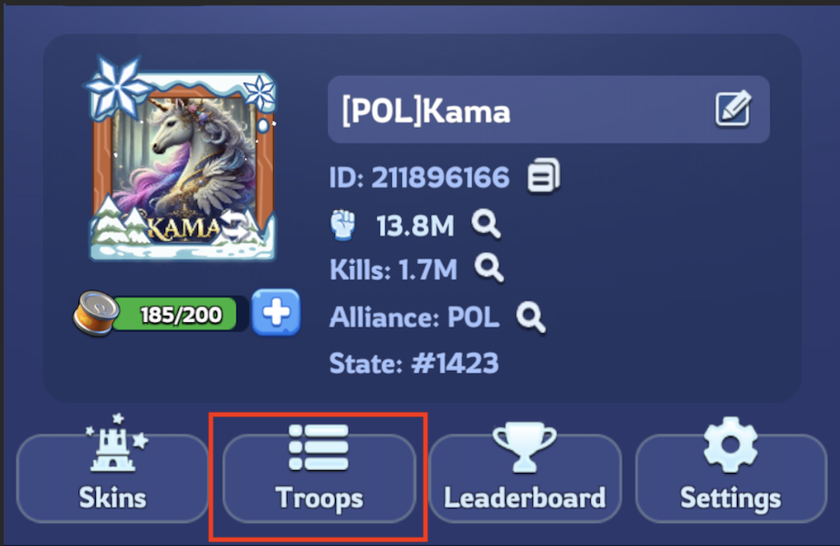
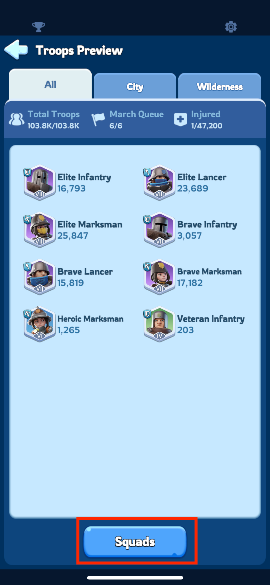 
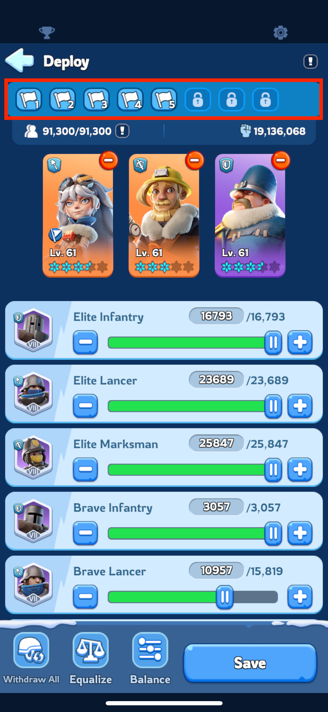    

### Starting a Rally:

Only those players who are in the **first three rows around the bear trap should start a rally** for bear hunting.

To save a formation with your top three attack heroes, click the first flag icon and pick your heroes
These can be:
- **Molly**
- **Bahiti**
- **Sergey**

In the formation for starting a rally, the order of heroes makes no difference, so they can be set up like this:
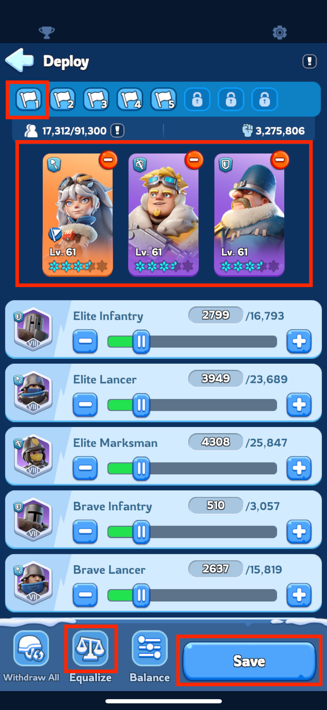
Click Save and confirm by choosing the flag icon again.
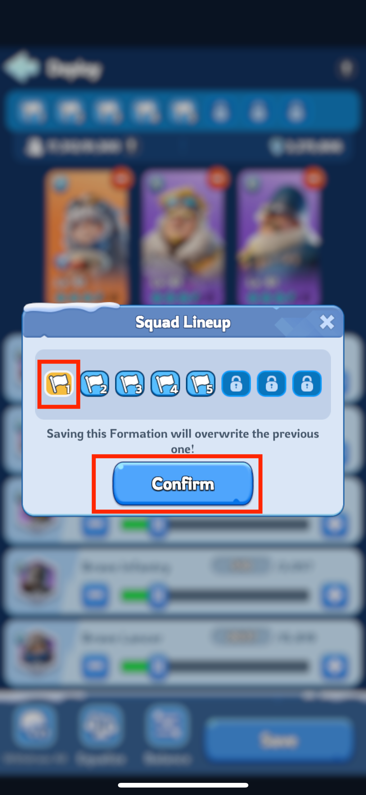

### Joining a rally 
Everyone should set up their formations for joining rallies. Those squads are very important, as they bring a bonus which will impact the whole rally.

When you join a rally **tonly the first hero is importnad** for the rally, because **their first expedition skill** gives bonus, the other heroes are ignored.
Therefor the order of heroes is so important.

Below you see which skills we are talking about when joining rallies:

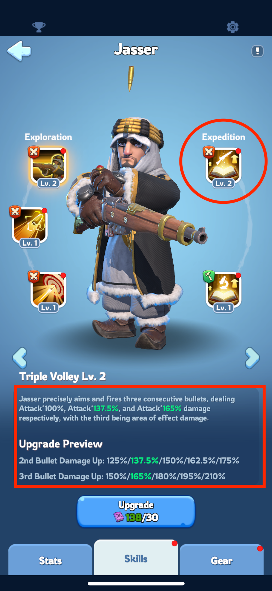
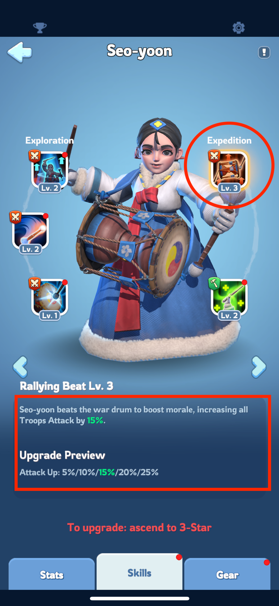

#### Rally squads setup

1. 1st rally **Jessie** in the first slot and additional heroes for support
  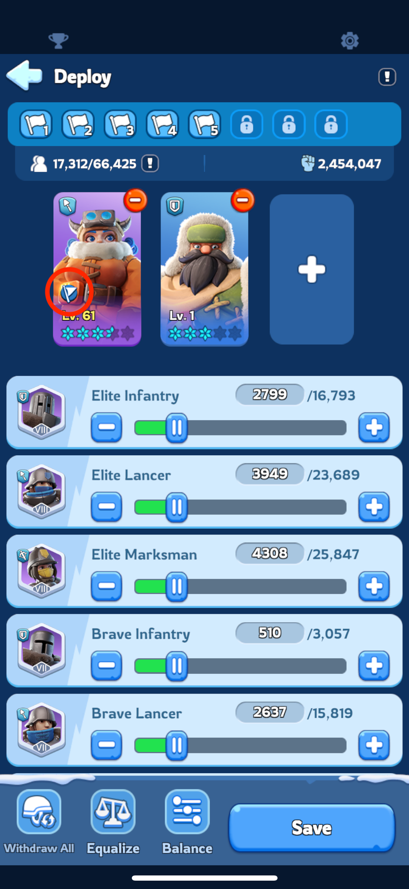
2. 2nd rally **Jasser** in the first slot and additional heroes for support
  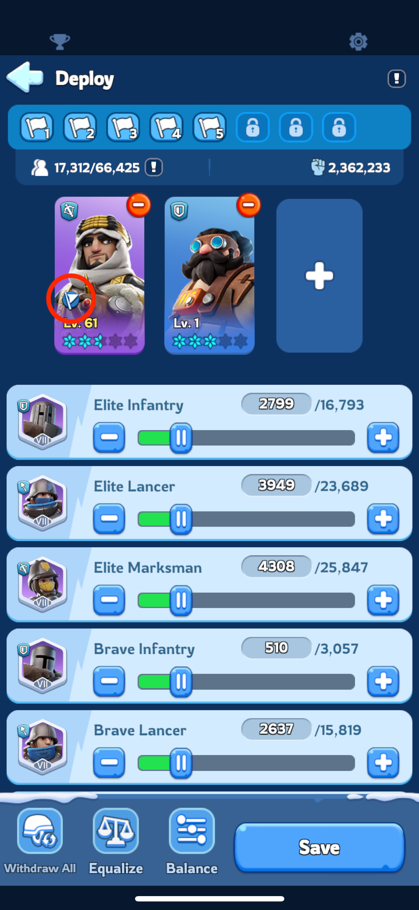
3. 3rd rally **Seo-yoon** in the first slot and additional heroes for support
  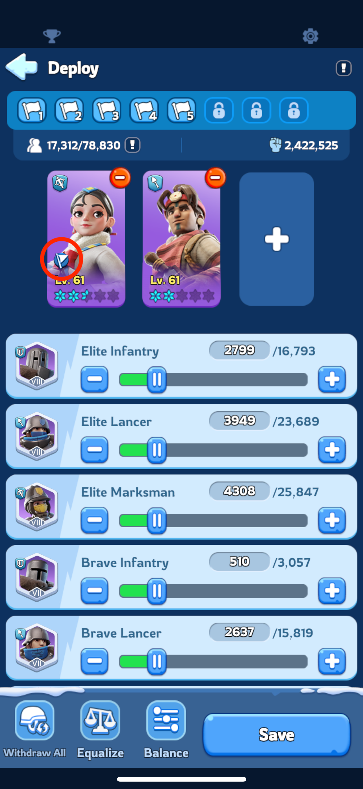
4. other rallies pick hero with damage dealt or attack boost in their first expedition skill. **If none of those left, join rally without a hero**  
  

**This is wrong setup, as the good hero is not in the first slot and thus not rally captain**

By saving these formations ahead of bear hunting, you can quickly and effectively participate in rallies, ensuring you maximize your damage output and rewards. 