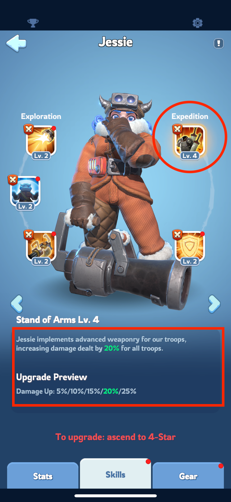
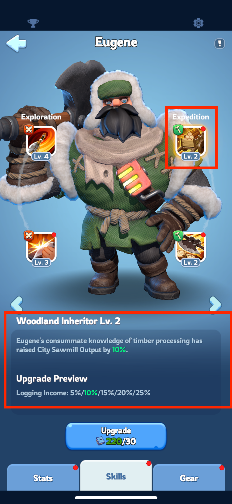

# Automatyczne dolaczanie do rajdu ze zdefiniowana formacja
Kiedy włączysz Auto-Dolaczanie, twój oddział automatycznie dołączy do rajdu stworzonego przez członków twojego sojuszu,
który odpowiada wybranym przez ciebie typom.

Funkcja ta uruchomi się dla rajdów Polar Terror lub Gina's Revenge, ale nie zadziała dla rajdów organizowanych przeciwko innym graczom ani rajdów w czasie polowania na niedźwiedzie.

Po włączeniu, Auto-Dolaczanie pozostaje aktywne przez 8 godzin, czas ten można wydłużyć, ponownie aktywując Auto-Join.

Gorąco zalecamy, aby wszyscy korzystający z tej funkcji **ustawili ją z przypisaną Formacją**.

## Konfiguracja

Aby aktywowac automatyczne dolaczanie, kliknij:

`Sojusz -> Wojna -> Automatyczne dolaczanie`.

Tam zaznacz pole `Uzyj formacji` i kliknij `ikonke z zebatka` aby ustawic oddzial do polowania.

Pamiętaj, że Auto-Dolaczanie uruchamia się dla wszystkich poziomów wybranych typów rajdów,
w tym także Polar Terror poziomu 4 lub 5.
Gdy walczymy z tymi silniejszymi potworami, ważne jest, aby wybrać odpowiednich bohaterów i jednostki.

Tworząc swoją formację, wybierz Jessie, Jasser lub Seo-Yoon jako kapitana rajdu, ponieważ ich umiejętności zapewniają bardzo przydatne bonusy
(sprawdź widok bohatera -> zakładka umiejętności -> umiejętność w prawym górnym rogu).

Jest to kluczowe, ponieważ wybrany kapitan rajdu może wpłynąć na cały rajd i albo zapewnić dodatkowy bonus, albo zupelnie zniszczyć linię bonusów i zaszkodzic wszystkim.

### Przykladowa konfiguracja::

#### Prawidlowa:
To jest przykład ustawienia do polowania na potwory, gdzie wybraliśmy Jessie jako kapitana rajdu. 
Jej glowna (prawa gorna) umiejetnosc ekspedycji gwarantuje bonus do zadawanych obrażeń.

#### Nieprawidlowa:

Kolejny przykład pokazuje nieprawidłowe ustawienie bohaterów do dołączania do rajdów. 
Chociaż Jessie jest wybrana, nie jest ustawiona jako kapitan rajdu, więc jej glowna umiejętność ekspedycji nie zostanie użyta w rajdzie. 
Zamiast tego zostanie użyta umiejętność Eugene'a, która bedzie bezużyteczna w rajdzie.

