# Polowanie na Niedźwiedzia

Wydarzenie polowania jest aktywowane przez R4/R5 co dwa dni. 
Po rozpoczęciu wydarzenia wszyscy członkowie mają 30 minut na pokonanie rozwścieczonego niedźwiedzia. 
Nagrody są tym lepsze, im więcej obrażeń twoje wojska są w stanie zadać niedźwiedziowi. 
Ponieważ niedźwiedź ma dużo zdrowia, dobra strategia jest kluczowa, aby zmaksymalizować zadane obrażenia.

## Rozpoczynanie Rajdu

Ponieważ nagrody zależą od zadanych niedźwiedziowi obrażeń, ważne jest, aby starannie wybrać najlepszych bohaterów. 
Wystawiajac rajd, statystyki i umiejętności wszystkich trzech bohaterów używanych przez kapitana rajdu są brane pod uwagę i nie ma znaczenia kolejnosc bohaterow startujacych rajd.

Niektórzy bohaterowie mają jednak umiejętności ekspedycyjne lepiej dopasowane do rajdów.

Rozważ użycie następujących bohaterów podczas rozpoczynania rajdu jako gracz free2play:

* **Molly** - umiejętność #1 daje szansę na ogłuszenie celu na 1 rundę, umiejętność #2 daje 50% szansy na dodatkowe obrażenia, umiejętność #3 gwarantuje zadane obrażenia dla wszystkich wojsk
* **Bahiti** - umiejętność #2 daje 50% szansy na zwiększenie zadanych obrażeń przez wszystkie wojska
* **Sergey**

Jeśli jesteś graczem pay2win, możesz również rozważyć użycie:

* **Natalia** - zwiększa atak wszystkich wojsk z aktywowaną siłą Ursusa, umiejętność #1 zwiększa szansę na ogłuszenie wroga na 1 rundę, umiejętność #2 zwiększa atak wszystkich wojsk, umiejętność #3 zwiększa zadane obrażenia
* **Zinman** - umiejętność #3 zwiększa zadane obrażenia wszystkich wojsk
* **Jeronimo** - umiejętność #1 zwiększa zadane obrażenia, umiejętność #2 zwiększa atak wszystkich wojsk, umiejętność #3 daje szansę na ogłuszenie celu na 1 rundę

Oprócz umiejętności ekspedycyjnych, twoje ogólne statystyki, w tym sprzęt dowódcy, talizmany, sprzęt bohatera i placówki ataku sojuszu, przyczyniają się do twoich obrażeń. Aby uzyskać maksymalną śmiertelność, aktywuj buf wojenny. Upewnij się, że twój najlepszy sprzęt, szczególnie w slotach na gogle i buty, jest wyposażony na twoich trzech najlepszych bohaterów ataku.
Na przykład Natalia jest bohaterką Piechoty, więc jej sprzęt powinien zwiększać śmiertelność Piechoty.

## Dołączanie do Rajdu

Istnieją specjalne zasady dotyczące dołączania do rajdu utworzonego przez innego gracza. Pierwszy bohater, którego dodasz do rajdu, jest kluczowy, szczególnie jego pierwsza umiejętność ekspedycyjna (prawy górny róg), która zostanie dodana do linii bonusów całego rajdu.

Umieść jednego z tych bohaterów w pierwszym slocie dla maksymalnej skuteczności:

* **Jessie**: Zwiększa obrażenia zadawane przez wszystkie wojska
* **Jasser**: Zwiększa obrażenia zadawane przez wszystkie wojska
* **Seo-yoon**: Zwiększa atak wszystkich wojsk

Priorytetem są umiejętności zwiększające zadawane obrażenia, a następnie te zwiększające atak wojsk.

Możesz sprawdzić konfigurację rajdu, klikając na rajd, aby rozwinąć uczestników, a następnie klikając ikonę żółtej flagi. Po przewinięciu na dół zobaczysz umiejętności używane przez bohaterów prowadzących rajd oraz zestawienie umiejętności uczestników rajdu. Celem jest zgromadzenie tylko właściwych umiejętności w tej linii, aby uzyskać maksymalny bonus do zadanych obrażeń.

## Przykłady

### Molly jako Kapitan Rajdu

Na poniższym zrzucie ekranu wszyscy uczestnicy wybrali Molly jako kapitana rajdu, co spowodowało, że umiejętność Molly była czterokrotnie wykorzystana w linii umiejętności uczestników rajdu - Calling of the snow, co się zsumowało. Ta umiejętność ekspedycyjna daje szansę na ogłuszenie celu na 1 rundę. Więc nie jest to gwarantowany bonus, ale szansa na jego uzyskanie.

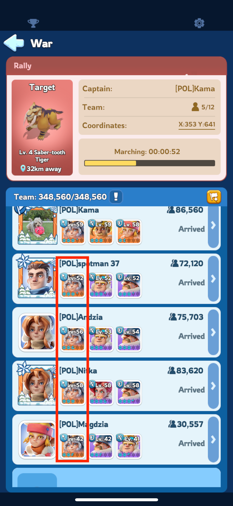
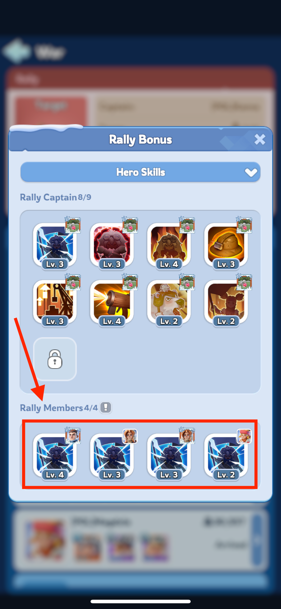

### Jessie jako Kapitan Rajdu

Poniższa sekcja ilustruje sytuację, gdy uczestnicy rajdu wybrali Jessie jako kapitana rajdu. W rezultacie pierwsza umiejętność ekspedycyjna Jessie została dodana do linii umiejętności, zapewniając gwarantowany bonus do zadanych obrażeń.

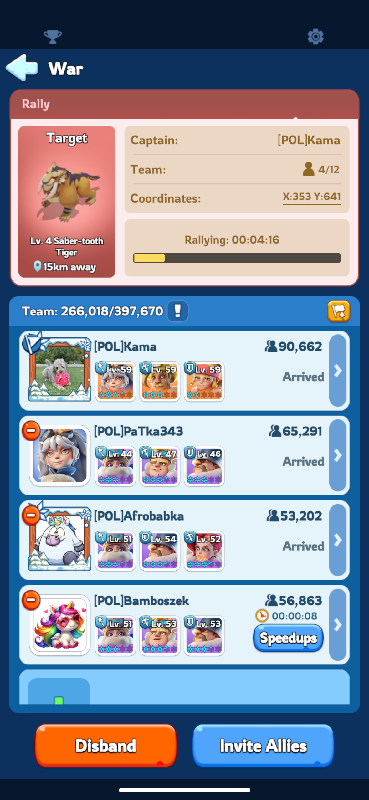
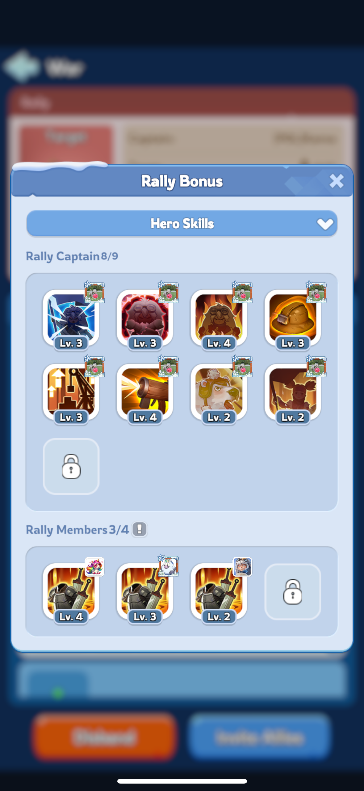

### Mieszanka różnych bohaterów jako kapitanów rajdu

Poniższa sekcja ilustruje sytuację, gdy uczestnicy rajdu wybrali różnych bohaterów jako kapitanów rajdu. W rezultacie pierwsza umiejętność ekspedycyjna każdego z nich jest brana pod uwagę jako kandydat do linii umiejętności, a cztery umiejętności o najwyższym poziomie zostaną wybrane.

|  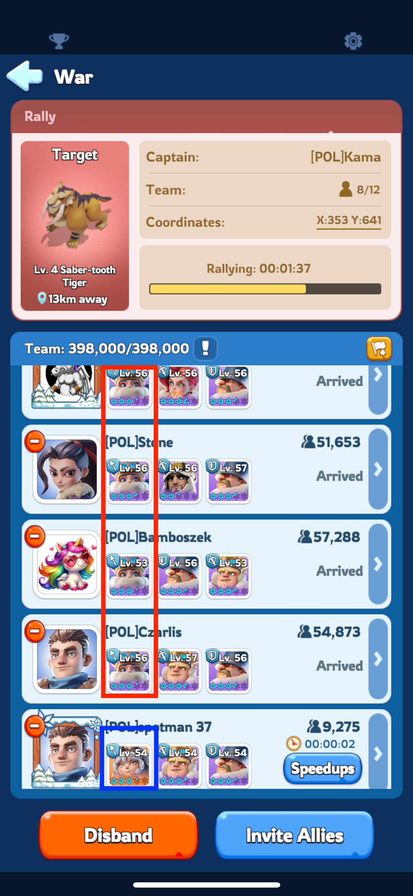  |
|:------------------------------------------------:|
| *Wszyscy oprocz jednego gracza dolaczyli Jessie* |

W wyniku powyższego ustawienia, umiejętność Jessie została uwzględniona w linii trzy razy, a umiejętność Molly raz. Pomimo że czterech graczy dołączyło z Jessie, a tylko jeden z Molly, okazało się, że umiejętność Molly była na wyższym poziomie niż jedna z umiejętności Jessie. To oznacza, że konfiguracja rajdu straciła jeden z gwarantowanych bonusów do obrażeń, które mogłaby mieć, gdyby Molly nie została dodana do rajdu.

|                                         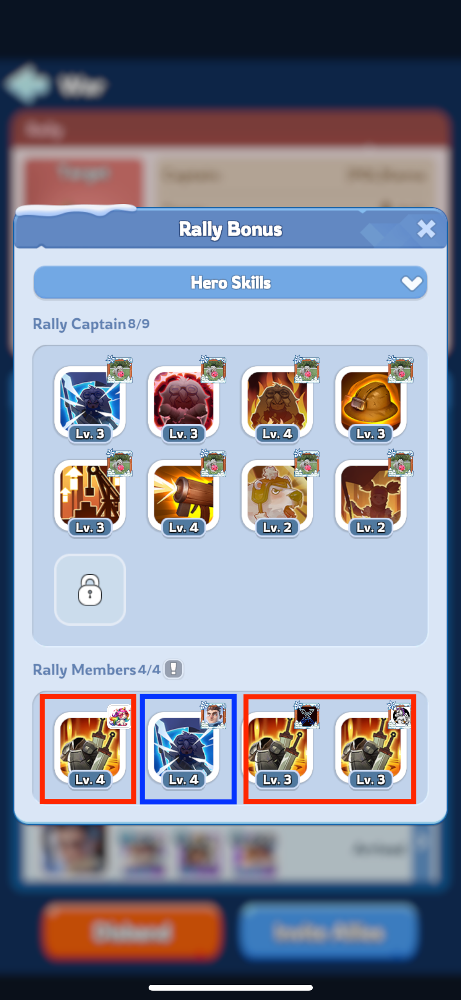                                          |
|:-------------------------------------------------------------------------------------------------------------------------------------:|
| *Mimo ze 4 graczy dolaczylo z Jessie, umiejetnosc Molly zostala dodana do rajdu, poniewaz miala wyzszy poziom niz umiejetnosc Jessie* |

Aby naprawić ten problem, gracza z Molly jako kapitanem rajdu można usunąć z rajdu przez lidera rajdu, wtedy umiejętność Jessie byłaby dodana cztery razy. 
Aby uniknąć tej sytuacji, lepiej dołączyć do rajdu bez żadnych bohaterów, ponieważ nie wpłynie to na linię umiejętności. 
W przypadku Molly jej umiejętność nie gwarantuje bonusu, ale daje szansę na jego uzyskanie, więc możesz rozważyć jej pozostawienie w linii umiejętności. 
**Jednak gdy zobaczysz, że niebieski lub zbierający bohater jest dodany do rajdu jako kapitan, nie wahaj się go usunąć, ponieważ negatywnie wpływa to na wynik każdego uczestnika rajdu.**

|                                                                            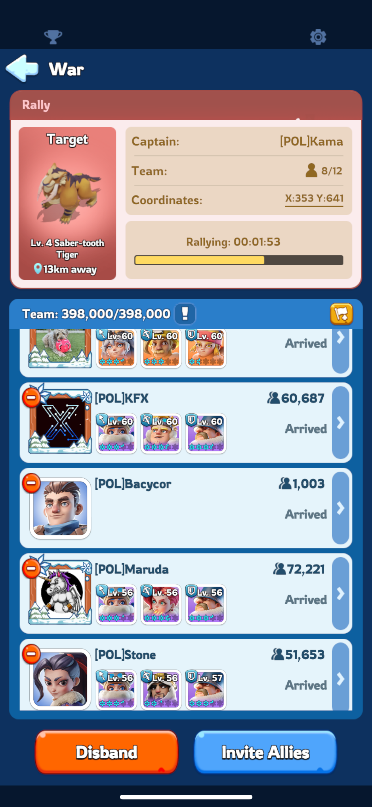                                                                            |
|:------------------------------------------------------------------------------------------------------------------------------------------------------------------------------------------------------:|
| *To absolutnie OK, jesli dolaczysz do rajdu bez bohaterow. Nie bedzie to mialo negatywnego wplywu na caly sklad rajdu, wplynie jedynie na ilosc wojska jaka mozesz dolaczyc do tego konkretnego rajdu* |

## Przygotowanie Oddzialow

Kliknij avatar -> Oddzialy -> Druzyny, tab beda male flagi w gornej czesci ekranu. To ile ich jest odblokowanych, zalezy od twojego poziomu.
Kiedy zapisujesz formacje kliknij przycisk **wyrownaj**, zeby dodac jednakowa ilosc wojska do kazdej druzyny.

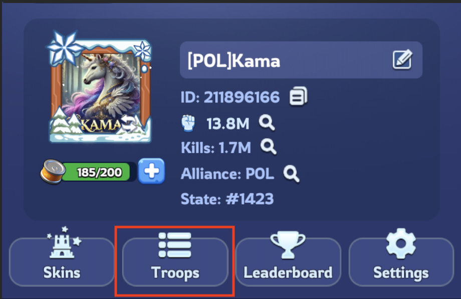
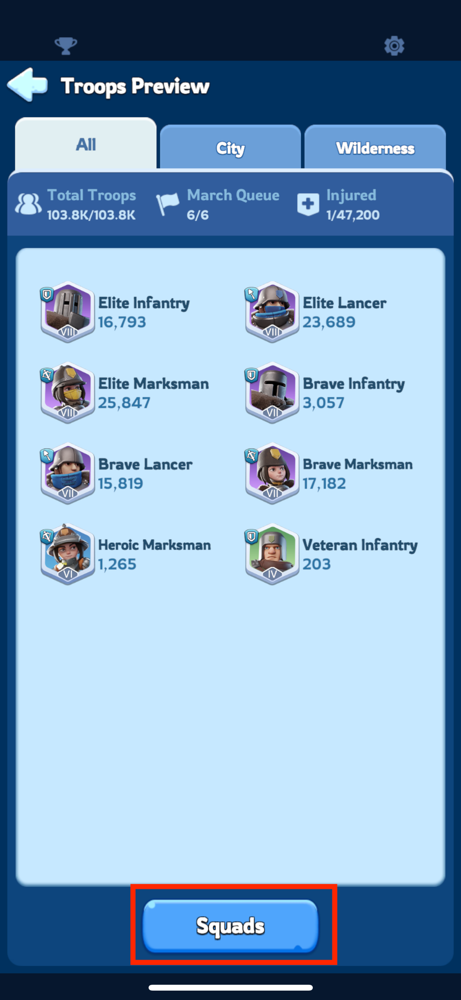
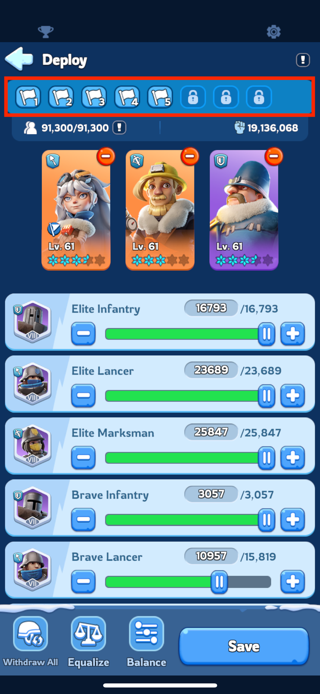

### Rozpoczynanie Rajdu:
Tylko **gracze z 3 pierwszych rzedow przy pulapce startuja rajdy** na niedzwiedzia.

Zapisz formację z trzema najlepszymi bohaterami ataku.
Mogą to być:

* **Molly**
* **Bahiti**
* **Sergey**

W formacji ktora startuje rajd, kolejnosc bohaterow nie ma znaczenia, Wiec mozna ich rozmiescic np tak:
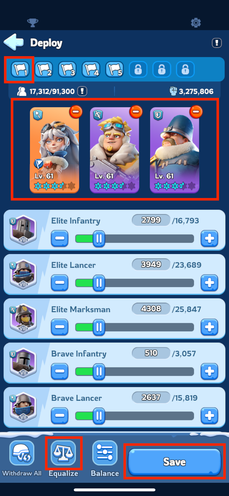
Kliknij Zapisz i potwierdz zaznaczajac znowu flage.
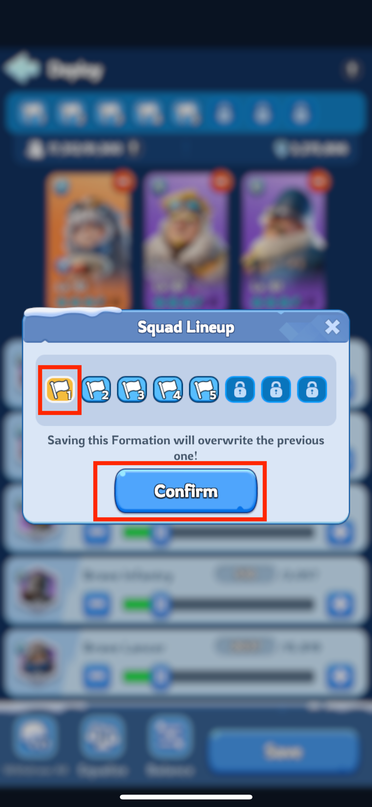

### Dołączanie do Rajdu
Kazdy powinien przygotowac formacje do dolaczenia do rajdu. Te druzyny sa bardzo wazne, poniewaz dodaja bonusy, ktore wplywaja na caly rajd.

Kiedy dolaczasz do rajdu **tylko pierwszy bohater ma znaczenie** dla rajdu, bo jego **pierwsza umiejetnosc ekspedycji** daje bonus, pozostali sa ignorowani. Dlatego kolejnosc bohaterow jest tak wazna.
Ponizej pokazane jest o ktore umiejetnosci chodzi;
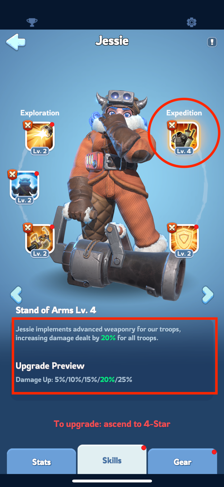
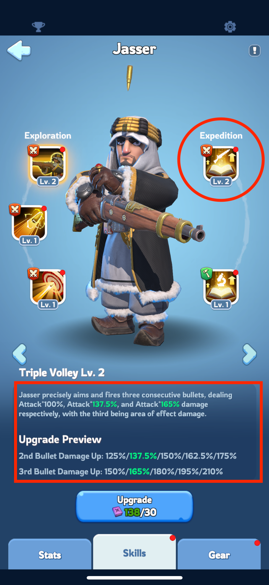
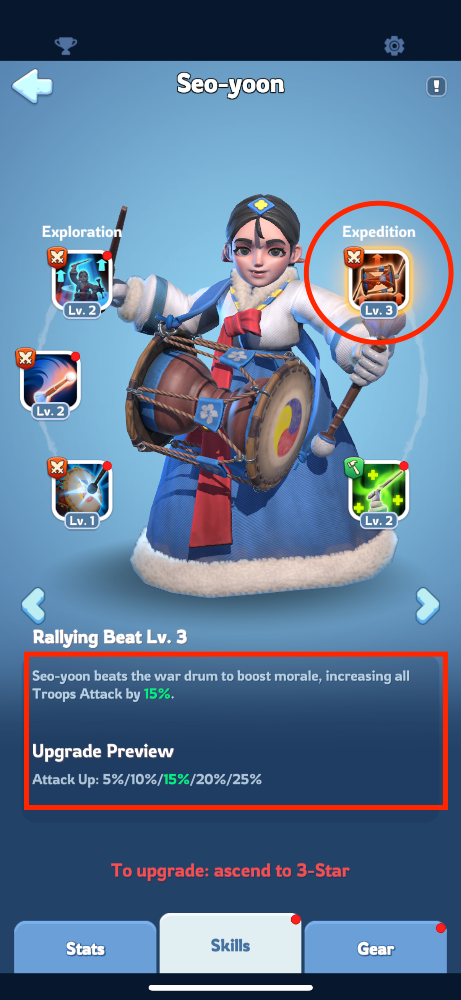

#### Ustawienie formacji do dolaczenia do rajdu

1. rajd: **Jessie** w pierwszym slocie i dodatkowi bohaterowie do wsparcia
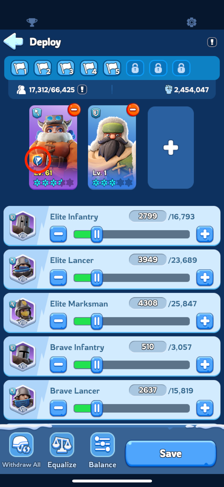
2. rajd: **Jasser** w pierwszym slocie i dodatkowi bohaterowie do wsparcia
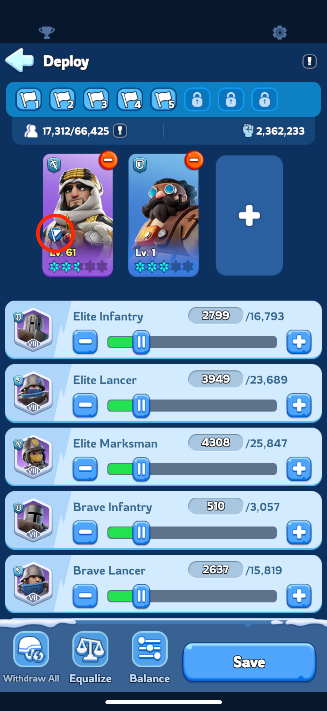
3. rajd: **Seo-yoon** w pierwszym slocie i dodatkowi bohaterowie do wsparcia
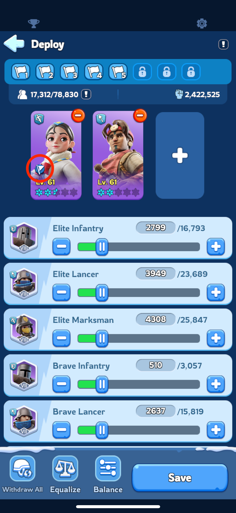
4. i kolejne rajdy: wybierz bohatera z umiejętnością zwiększającą zadane obrażenia lub atak w pierwszej umiejętności ekspedycyjnej. **Jeśli żaden z nich nie jest dostępny, dołącz do rajdu bez bohatera**
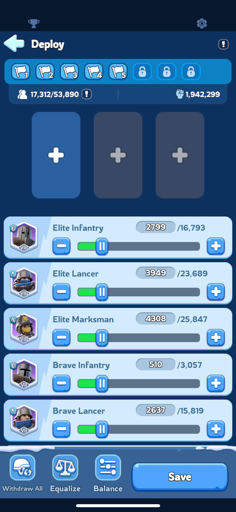

**To jest zle ustawienie, poniewaz wlasciwy bohater (Jessie) nie jest w miejscu kapitana rajdu**

Zapisując te formacje przed polowaniem na niedźwiedzia, możesz szybko i skutecznie uczestniczyć w rajdach, maksymalizując zadane obrażenia i nagrody. 