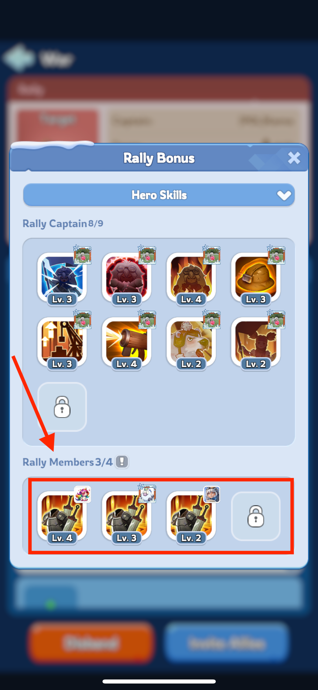

# Bear Hunting Guide

The hunting event is activated by R4/R5 every two days at 18:00 UTC. Once the event starts, all members have only 30 minutes to defeat the raging bear. The rewards improve with the amount of damage your troops can inflict on the bear. Since the bear has a lot of health, a good strategy is crucial to maximize your damage output.

## Starting a Rally

Since rewards are based on the damage done to the bear, selecting the best heroes and troops is important. The stats and skills of all three heroes used by the rally captain are taken into account. 
Some heroes have expedition skills better suited for rallies. 

Consider using the following heroes when starting a rally:

* Molly
* Natalia
* Bahiti
* Sergey
* Zinman

In addition to expedition skills, your overall stats, including chief gear, charms, hero gear, and alliance attack% facilities, contribute to your damage. For maximum lethality, activate a war buff. 
Ensure your best gear, especially in the goggles and boots slots, is equipped on your top three attack heroes. 
For example, Natalia is an Infantry hero, so her gear should enhance Infantry lethality.

## Joining a Rally

When setting your formation, the first hero slot has a tiny flag. 
This indicates that when you join someone else's rally, the first hero you pick will have their first (top right) expedition skill used in the rally bonus lineup. 
Place one of these heroes in the first slot for maximum effectiveness:

* Jessie: Increases damage dealt by all troops
* Jasser: Increases damage dealt by all troops
* Seo-yoon: Increases all troops' attack

Prioritize skills that increase damage dealt, followed by those that increase troops' attack.

You can see the lineup of skills that will be used in the rally bonus by inspecting the rally screen. On screenshots all participants put Molly as Rally Capitan, which resulted in rally members skill being 4 times Mollies skill, which stacked up together.
First expedition skill of Molly gives a chance of stunning the target for 1 round. So this is not a guaranteed bonus we get there, 
but it is a good chance of getting a bonus.

In situation when rally joiners select Jessie or Jasser as the first hero, their first expedition skill will be used and it guarantee a nice damage dealt bonus.

## Save Your Formations

Formation for Starting a Rally: 
Save a formation with your top three attack heroes.

Formation for Joining a Rally: 
Save a formation with Jessie in the first slot and additional heroes for support.
Additional Formation for Joining Rallies: Save a formation with Jasser in the first slot for joining another rally.

By saving these formations, you can quickly and effectively participate in rallies, ensuring you maximize your damage output and rewards. 