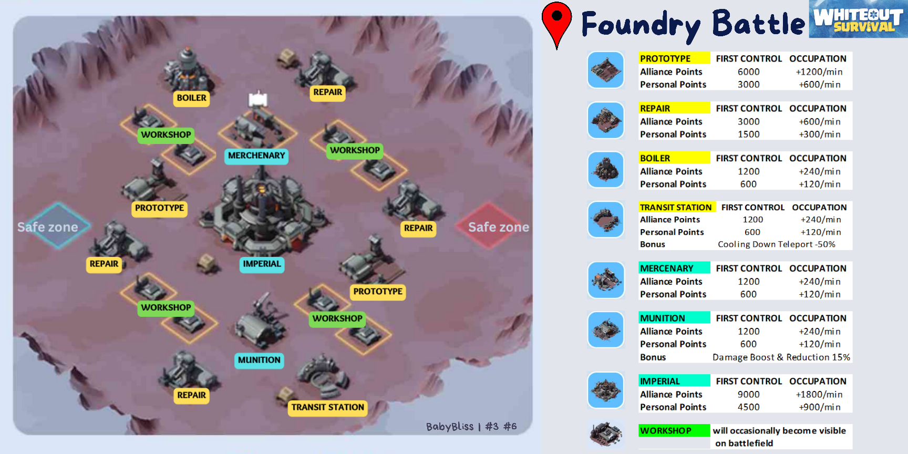

# Foundry Battle Guide

The Foundry Battle occurs every two weeks. The minimum requirement to participate is a Furnace level of 16.

## How to Enter the Battlefield:
* Ensure all your troops are in the city: No scouting, reinforcing, resource gathering, attacking, etc.
* Heal all injured troops: Make sure there are no injured troops before the event starts.
* Send away any reinforcements: Your city should not have any reinforcements.
* Extinguish any fires on your barricade: Ensure your barricade is not burning before the event starts.

## Strategy

The goal of this event is to occupy buildings and collect as many points as possible. We need to take over these buildings and remain in them to gather points. The longer we occupy them, the more points we will accumulate.

The Foundry Battle is similar to the Frostfire Mine event, but instead of solo play, it is a team event and we will play against another alliance.

You can use advanced teleport for free, though it will have a cooldown period before it can be used again.
Use advanced teleport to quickly reach buildings and move closer to the center of the map.
Be aware that if you occupy buildings and teleport again, your troops will withdraw from those buildings, and you may lose the points you have accumulated temporarily.
During the battle, no troops will die; they will be injured and sent to the infirmary, which will have unlimited capacity during the event. All troops will be healed for free during the event and will automatically recover once the event is over. If your city is attacked during the battle, make sure to extinguish the barricade quickly.

## Buildings

There will be multiple different buildings on the battlefield, each with different point values and requirements to occupy them:

* Imperial Foundry: Key to winning, should be taken by the strongest players as it will likely face the heaviest attacks.
* Prototype Sites: There are two of these, second in terms of points to collect.
* Repair Facility: Four located in the corners of the map.
* Munitions Warehouse: Provides a 15% troop damage boost and damage reduction.
* Mercenary Camp
* Central Transit: Reduces cooldown for advanced teleport by 50%.
* Boiler Room: Reduces control time required for buildings to accumulate points by 50%.

This guide should help you prepare and strategize for the Foundry Battle, maximizing your point collection and overall success in the event.
